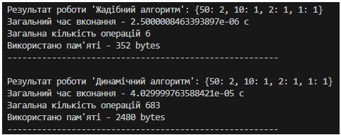

# HomeWork Module 9 Neoversity

У конспекті ми розглянули приклад про розбиття суми на монети. Маємо набір монет [50, 25, 10, 5, 2, 1]. Уявіть, що ви розробляєте систему для касового апарату, яка повинна визначити оптимальний спосіб видачі решти покупцеві.

Вам необхідно написати дві функції для касової системи, яка видає решту покупцеві:

<ol>
    <li><b>Функція жадібного алгоритму find_coins_greedy.</b> Ця функція повинна приймати суму, яку потрібно видати покупцеві, і повертати словник із кількістю монет кожного номіналу, що використовуються для формування цієї суми. Наприклад, для суми 113 це буде словник {50: 2, 10: 1, 2: 1, 1: 1}. Алгоритм повинен бути жадібним, тобто спочатку вибирати найбільш доступні номінали монет.</li>
    <li><b>Функція динамічного програмування find_min_coins.<b> Ця функція також повинна приймати суму для видачі решти, але використовувати метод динамічного програмування, щоб знайти мінімальну кількість монет, необхідних для формування цієї суми. Функція повинна повертати словник із номіналами монет та їх кількістю для досягнення заданої суми найефективнішим способом. Наприклад, для суми 113 це буде словник {1: 1, 2: 1, 10: 1, 50: 2}</li>
</ol>

Порівняйте ефективність жадібного алгоритму та алгоритму динамічного програмування, базуючись на часі їх виконання або О великому та звертаючи увагу на їхню продуктивність при великих сумах. Висвітліть, як вони справляються з великими сумами та чому один алгоритм може бути більш ефективним за інший у певних ситуаціях. Свої висновки додайте у файл <b>readme.md</b> домашнього завдання.

## Результати

Як бачимо, жадібний алгоритм працює значно швидше та ідеально підходить за умови правильно підібраних наборів даних, тобто вже належним чином преоборазованих, відсортованих, тощо. Проте за інших неідеальних умов може знайти ненайкраще рішення.

В свою чергу динамічний алгоритм пропрацьовує всі можливі варіанти та вже з них обирає найкращій. Але це відображається на суттєвому збільшені необхідних для розрахунків ресурсів, як часових так і пам'яті.

Як бачимо, часова складність для жадібного алгоритму становить О(k), де k - це кількість монет;
часова складність для динамічного алгоритму становить О(k * n), де k - це кількість монет, а n - необхідна нам сума.

Також вбачається лінійне збільшення пам'яті для динамічного алгоритму в заледності від розміру необхідної нам суми. В той час як для жадібного алгоритму використання пам'яті та кількість операцій майже незмінні на будь-яких розмірах суми.
